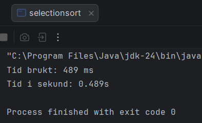
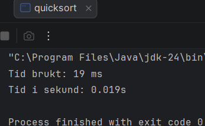

# dat102 - obligatorisk innlevering 2

**Leveringsfrist**: 20. februar 2026

**Gruppemedlemmer**

| *Navn*                       | *Github brukernavn* |
| ---------------------------- | ------------------- |
| Bartosz Paszkiewicz          | Paszkiewicz         |
| Lars Birger Bergmål          | larsbirger          |
| Markus Fosse Høvring         | Markus-Hovring      |
| Daniel Aarsand               | brasswhisper-hub    |

---

## Oppgave 1: Parentessjekker (Uke 6)

### Beskrivelse

Jeg har implementert en `ParentesSjekker` som bruker en stabel (`TabellStabel`) for å validere om parenteser i en streng er korrekt balansert og plassert. Algoritmen sjekker mot symbolene `(`, `[`, og `{`.

### Skjermbilde av kjøring (JUnit-tester)

---

## Oppgave 2: Optimalisert Insertion Sort (Uke 7, Oppgave 1)

### Beskrivelse

Jeg har implementert en kombinert optimalisering av Insertion Sort som inkluderer:

1. **Vaktpost (Sentinel):** Det minste elementet flyttes først til posisjon 0 for å forenkle `while`-løkken.

2. **Dobbel innsetting:** To elementer settes inn samtidig for å redusere antall flyttinger i den sorterte delen av tabellen.

### Observasjoner

Etter å ha endret koden til a finne den minste verdien først for å så sette den ved index = 0, og flytte to elementer av ganger ble det observert en tids reduksjon fra $12.2 s$ til $5.4 s$.

**Analyse:** Ved å flytte to elementer av gangen reduseres antall sammenligninger i den indre løkken, og vaktposten fjerner behovet for å sjekke om indeksen  i hver iterasjon.

## Oppgave 3: Sammenligning av sorteringsmetoder (Uke 7, Oppgave 2)

### Måleresultater

Her er gjennomsnittstidene målt på min maskin for de ulike algoritmene.

her er $n$ størrelsen på datasettet som ble sortert

**Tabell for quick sort**

| $n$       | Antall målinger | Målt tid (snitt) | Teoretisk tid (ms) |
| --------- | --------------- | ---------------- | ------------------ |
| 32 000    | 10              | 13.6          ms | 13              ms |
| 64 000    | 10              | 28.0          ms | 28.9            ms |
| 128 000   | 10              | 54.7          ms | 61.7            ms |

**Tabell for merge sort**

| $n$       | Antall målinger | Målt tid (snitt) | Teoretisk tid (ms) |
| --------- | --------------- | ---------------- | ------------------ |
| 32 000    | 10              | 761.7         ms | 761.7           ms |
| 64 000    | 10              | 2567.4        ms | 1622.4          ms |
| 128 000   | 10              | 8815.1        ms | 3450.5          ms |

**Tabell for insertion sort**

| $n$       | Antall målinger | Målt tid (snitt) | Teoretisk tid (ms) |
| --------- | --------------- | ---------------- | ------------------ |
| 32 000    | 10              | 68.5          ms | 68.5            ms |
| 64 000    | 10              | 233.2         ms | 274.0           ms |
| 128 000   | 10              | 865.2         ms | 1096.0          ms |

**Tabell for selection sort**

| $n$       | Antall målinger | Målt tid (snitt) | Teoretisk tid (ms) |
| --------- | --------------- | ---------------- | ------------------ |
| 32 000    | 10              | 517.7         ms | 517.7           ms |
| 64 000    | 10              | 2254.4        ms | 2070.8          ms |
| 128 000   | 10              | 8164.7        ms | 8283.2          ms |

### Teorispørsmål

**1. Samsvarer de teoretiske resultatene med de målte?**

Ja, de målte resultatene samsvarer i stor grad med de teoretiske forventningene,
spesielt for algoritmene med kvadratisk kjøretid:

* **$O(n^2)$-algoritmer (Selection og Insertion Sort):**
  Teorien tilsier at tiden skal firedobles når datamengden $n$ dobles.
  Mine målinger viser dette tydelig.
  For eksempel økte Selection Sort fra **517.7 ms** til **2254.4 ms** (faktor på ~4.35).
  Insertion Sort fulgte også dette mønsteret tett.

* **$O(n \log n)$-algoritmer (Quick Sort):**
  Quick Sort viser en stabil vekst som ligger svært nær
  de teoretiske beregningene (faktor på ~2.1).
  Dette bekrefter algoritmens effektivitet på store datasett.

* **Avvik i Merge Sort:**
  Mine målinger for Merge Sort viser et betydelig avvik fra teorien
  ved økende $n$ (fra 761 ms til 2567 ms er en økning på faktor ~3.3,
  som er høyere enn teoretisk ~2.1).
  Dette skyldes sannsynligvis overhead i Java
  ved opprettelse av mange hjelpetabeller,
  som fører til mer arbeid for "Garbage Collector" når minnebruken øker.

**2. Hva skjer når Quicksort sorterer en tabell der alle elementene er like?**

Når Quicksort sorterer en tabell der alle elementene er like,
kan man oppleve algoritmens "verste tilfelle" (worst case)
avhengig av implementasjonen:

* **Ubalansert partisjonering:**
  Hvis partisjoneringslogikken ikke håndterer like verdier
  spesifikt (ved å stoppe eller bytte på like verdier),
  vil pivot-elementet dele tabellen svært skjevt.
  Dette resulterer i at man får én partisjon med $n-1$ elementer og én med $0$,
  i stedet for to omtrent like store deler.

* **Kjøretid:**
  Den effektive kjøretiden på $O(n \log n)$ degenererer da til **$O(n^2)$**.

* **Stack Overflow:**
  Siden partisjoneringen blir så ubalansert,
  blir den rekursive dybden veldig stor ($n$ nivåer i stedet for $\log n$).
  Dette fører ofte til en `StackOverflowError` i Java
  fordi minnet til metodestabelen går tomt.

---

## Vedlegg: Skjermbilder av kjøring

