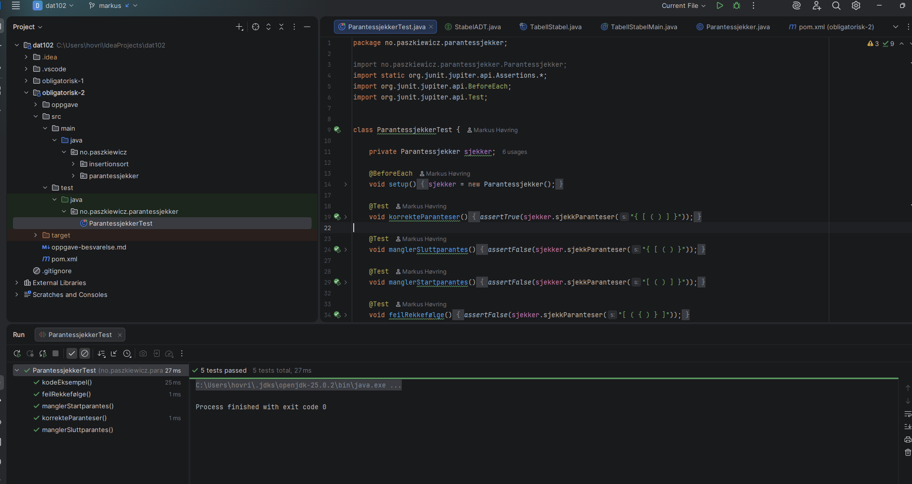
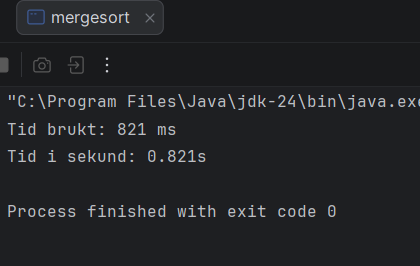

# dat102 - obligatorisk innlevering 2

**Leveringsfrist**: 20. februar 2026

**Gruppemedlemmer**

| *Navn*                       | *Github brukernavn* |
| ---------------------------- | ------------------- |
| Bartosz Paszkiewicz          | Paszkiewicz         |
| Lars Birger Bergmål          | larsbirger          |
| Markus Fosse Høvring         | Markus-Hovring      |
| Daniel Aarsand               | brasswhisper-hub    |

---

## Oppgave 1: Parentessjekker (Uke 6)

### Beskrivelse

Jeg har implementert en `ParentesSjekker` som bruker en stabel (`TabellStabel`) for å validere om parenteser i en streng er korrekt balansert og plassert. Algoritmen sjekker mot symbolene `(`, `[`, og `{`.

### Skjermbilde av kjøring (JUnit-tester)

---

## Oppgave 2: Optimalisert Insertion Sort (Uke 7, Oppgave 1)

### Beskrivelse

Jeg har implementert en kombinert optimalisering av Insertion Sort som inkluderer:

1. **Vaktpost (Sentinel):** Det minste elementet flyttes først til posisjon 0 for å forenkle `while`-løkken.

2. **Dobbel innsetting:** To elementer settes inn samtidig for å redusere antall flyttinger i den sorterte delen av tabellen.

### Observasjoner

Etter å ha endret koden til a finne den minste verdien først for å så sette den ved index = 0, og flytte to elementer av ganger ble det observert en tids reduksjon fra $12.2 s$ til $5.4 s$.

**Analyse:** Ved å flytte to elementer av gangen reduseres antall sammenligninger i den indre løkken, og vaktposten fjerner behovet for å sjekke om indeksen  i hver iterasjon.

## Oppgave 3: Sammenligning av sorteringsmetoder (Uke 7, Oppgave 2)

### Måleresultater

Her er gjennomsnittstidene målt på min maskin for de ulike algoritmene.

her er $n$ størrelsen på datasettet som ble sortert

Tabell for quicksortering

| $n$       | Antall målinger | Målt tid (snitt) | Teoretisk tid (ms) |
| --------- | --------------- | ---------------- | ------------------ |
| 32 000    | 10              | 13.6 ms          | 13 ms              |
| 64 000    | 10              | 13.6 ms          | 28.9 ms            |
| 128 000   | 10              | 13.6 ms          | 61.7 ms            |

Tabell for mergesortering

| $n$       | Antall målinger | Målt tid (snitt) | Teoretisk tid (ms) |
| --------- | --------------- | ---------------- | ------------------ |
| 32 000    | 10              | [Tid] ms         | [Tid] ms           |
| 64 000    | 10              | 13.6 ms          | [Tid] ms           |
| 128 000   | 10              | 13.6 ms          | [Tid] ms           |

Tabell for insertionsortering

| $n$       | Antall målinger | Målt tid (snitt) | Teoretisk tid (ms) |
| --------- | --------------- | ---------------- | ------------------ |
| 32 000    | 10              | 68.5 ms          | 68.5 ms            |
| 64 000    | 10              | 233.2 ms         | 274.0 ms           |
| 128 000   | 10              | 865.2 ms         | 1096.0 ms          |

Tabell for selectionsortering

| $n$       | Antall målinger | Målt tid (snitt) | Teoretisk tid (ms) |
| --------- | --------------- | ---------------- | ------------------ |
| 32 000    | 10              | [Tid] ms         | [Tid] ms           |
| 64 000    | 10              | 13.6 ms          | [Tid] ms           |
| 128 000   | 10              | 13.6 ms          | [Tid] ms           |

Tabell for Kvikksortering

| $n$       | Antall målinger | Målt tid (snitt) | Teoretisk tid (ms) |
| --------- | --------------- | ---------------- | ------------------ |
| 32 000    | 10              | [Tid] ms         | [Tid] ms           |
| 64 000    | 10              | 13.6 ms          | [Tid] ms           |
| 128 000   | 10              | 13.6 ms          | [Tid] ms           |

### Teorispørsmål

**1. Samsvarer de teoretiske resultatene med de målte?**
[Ditt svar her: Diskuter om tiden 4-dobles for -algoritmer når  dobles].

**2. Hva skjer når Quicksort sorterer en tabell der alle elementene er like?**
[Ditt svar her: Forklar om partisjoneringen blir ubalansert og hvordan dette påvirker kjøretiden (ofte mot )].

---

## Vedlegg: Skjermbilder av kjøring

